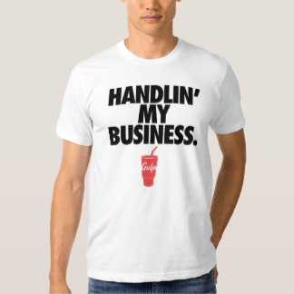

footer: ©2016 Philwinkle LLC __SunshinePHP 2016__
slidenumbers: true

# PCI Compliance for Hipsters
#### _**Or, How I Learned to Stop Worrying and Love Regulatory Compliance**_
##### Phillip Jackson<br>Magento Practice Lead, Something Digital

---


Or, Lots of boring stuff and<br/>then some Gulp and Node

---

# @philwinkle
# [fit] github.com/philwinkle


---


# @magetalk


---


> somethingdigital.com/careers


---

## 1. If I _**don't store**_ credit cards PCI _**doesn't apply**_

---

# [fit] FALSE


---

# This is why PCI sucks

---


# Audits suck more

---

# What this talk is about:

- What is PCI?
- Identifying ways that users and programmers can break compliance
- Finding problems before they go to production
- Introducing tools to aide you in your journey

---

# What this talk is not:

- A comprehensive survey of all of PCI (or any standard)
	- Every organization is different
	- There is no one-size fits all solution
- Really has nothing to do with hipsters

---

# PCI is not a law or a regulation

---


## It is a _standard_ created by major credit card issuers, banks


---

# In case you're bored:

> **tl;dr** don't accept payments you don't have to do any of this!

---


# this talk is about **toolkits**

---

# the problem is **there are none**

---

# at __**SD**__ we have to build them and maintain them

---

## About me:

- eCommerce developer since ~2000
- Magento Developer since late 2007
- I am not a PCI expert
- I **am** a lazy developer

---

# Quick overview of PCI

---

# Self-governance

---

# Review of **12 steps**

---

## PCI's 12 step program[^1]

	- Install and maintain firewall
	- Don't use vendor-supplied defaults for system passwords and other security parameters
	- Protect stored data
	- Encrypt the transmission of cardholder data and sensitive information across public networks
	- Use and regularly update antivirus software
	- Develop and maintain secure systems and applications
	- Restrict access to data by business need-to-know
	- Assign a unique ID to each person with computer access
	- Restrict physical access to cardholder data
	- Track and monitor all access to network resources and cardholder data
	- Regularly test security systems and processes
	- Maintain a policy that addresses information security

[^1]: February 2016 PCI v3.1 [https://www.pcisecuritystandards.org/documents/PCI_DSS_v3-1.pdf]
(https://www.pcisecuritystandards.org/documents/PCI_DSS_v3-1.pdf)

---

## We're going to talk about **2 of these** today

	- Protect stored data
	- Develop and maintain secure systems and applications

---


# [fit] **Protect stored data**

---


## *Warning:* This is a rabbit hole

---


## What constitutes "stored data" anyways?

Writing things to memory (setting them in a var) is technically "storing" the value

---

## What constitutes **"stored data"** anyways?

But it **is allowed with specific provisions:**

	- It is **not** stored in non-volatile memory (e.g. Hard drive)

	OR 

	- It **is** stored safely depending on the type of data that it is

---

Password ↠ **One-way hash**
Credit Card Number ↠ **Strong Encryption**
CVV ↠ **Never**

---

# Stored data:

The **entire** 15 or 16 digits of a credit card number

##### (The last 4 digits of the card is *not* considered cardholder data)

Customer authentication credentials (password, auth key, app id, biometrics)

---


# Safe storage

---

## Safe (Intentional) Storage

The obvious question (in February 2016):

**Which algo to use?**

OWASP suggests use of PBKDF2, bcrypt or scrypt for password storage[^2]


#### **Hashes:** Use the built-in `password_hash` algorithm in PHP 5.5+ (bcrypt)


[^2]: Magento stores can use PBKDF2 with a module for drop in encryption replacement via PHPCryptLib with [https://github.com/ikonoshirt/pbkdf2](https://github.com/ikonoshirt/pbkdf2) by @fabian_ikono


---

bad:


```php
$password = md5($salt . $_REQUEST['password']);
```

better:

```php
$password = password_hash($_REQUEST['password']);
```

---

### Is this storing the card safely?


```php
$ccNumber = $_GET['cc_number'];
$payment->setCreditCard($ccNumber);
$payment->save();
```

---

### A bit better (but increases your burden):

```php
$ccNumber = $helper->encrypt($_GET['cc_number']);
$payment->setCreditCard($ccNumber);
$payment->save();
```

---

# But I don't store credit cards?


---

## Storage **even in volatile memory** is still storage, but may not violate PCI.

---

There is no way to protect against this in your application:

```bash
$ curl --data "cc_number=4111111111111111" yourawesomesite.com
```

result:

```php
$_POST['cc_number'] //bullocks
```
---

This is why the standard dictates things like SSL

...and **Antivirus** (yes even on your **Production** hardware)

---

Side note: a WAF (web application firewall) is invaluable to your application

**ModSecurity** is OSS. If you're on AWS there is a WAF appliance.

---

In general **don't do this**. You increase your risk and therefore scope. Rather use methods provided by the bank to store the card with use of a token. 

---

# Logging

---


Proving that developers still have the power to potentially create risky scenarios. 

```php

class Payment implements \PaymentInterface
{
	public function authorizeAndCapture(LoggerInterface $logger)
	{
		//log the request son
		$logger->log($_GET);
	}

}
```

---


We can guard against those scenarios using ~~interpolation~~ brute force:

```php

class SuperSafeLogger implements \LoggerInterface
{
	use Psr\Log\LoggerTrait;

	public function log($level, $message, array $context = array());
	{
		$message = preg_replace('\d{15,16}','****************', $message);
	}

}
```
---


Logs usually get backed up or shipped off to another service for analysis. Is this transfer done **via SSL**?

This can create windows of opportunity to fall out of compliance.

---

So we know how to store things that we **expect to contain** sensitive data.  What about things that we don't expect to contain a credit card?

```
array(3) {
  ["firstname"]=>
  string(7) "Phillip"
  ["lastname"]=>
  string(7) "Jackson"
  ["address"]=>
  array(5) {
    ["street1"]=>
    string(16) "4111111111111111"
    ["street2"]=>
    string(0) "234"
    ["city"]=>
    string(15) "West Palm Beach"
    ["region"]=>
    string(2) "FL"
    ["postcode"]=>
    string(5) "33411"
  }
}
```


---

Client-side input validation helps.

In this case we can qualify by using the inverse of the `filter_var` to ensure fields are **not** numeric:

```php
if(filter_var($street1, FILTER_VALIDATE_INT)){
	throw new Exception('💩💩💩💩💩')	
}
```


---

Or, just fix your UX. 

---


#[fit] Developing **secure** systems


---

This goes beyond just the credit card data

---

At **SD** we use a number of techniques to ensure compliance:

- Peer review
- Mentor review
- Scrutinizer
- Unit tests
- Integration tests

---


## Peer review

---

## PCI 6.3.2:

\#1. Code changes are reviewed by individuals other than the originating code author, and by individuals knowledgeable about code-review techniques and secure coding practices.

---

## PCI 6.3.2:

\#2. Code reviews ensure code is developed according to secure coding guidelines

---

## PCI 6.3.2:

\#3. Appropriate corrections are implemented prior to release.

---

## PCI 6.3.2:

\#4. Code-review results are reviewed and approved by management prior to release.

---

What to focus on in code review?

- Don't trust the user
- Don't trust the programmer

In short, filter in, escape out.

---


Filter in

```php
$unsafe = $_GET['unsafe'];

if(!filter_var($unsafe, FILTER_VALIDATE_INT)){
	throw new Exception('¯\_(ツ)_/¯');
}
$pdo->bind($query, $unsafe);
```


Escape out

```php
echo $helper->escape($unsafe); //Or just use TWIG.
```

---

In this case `filter_var` is not just here for the protection of our application but for the protection of the **customer**.

---

#[fit] XSS

---

**Most** XSS attacks come from plain old<br/>run-of-the-mill echoing $_GET

---


But honestly peer review can't catch everything

---

## Introducing PHPCS

---

PHP CodeSniffer is an invaluable tool for testing code for common issues but you need a good set of **sniffs** to find code which breaks from best practice®™

**Caution**: having the right sniffs is crucial

---

ugly.php:

```php
<?php
//let's introduce an XSS
echo $_GET['unsafe'];
?>
```

---

Output of PHPCS default:

```
FILE: /Users/pjackson/ugly.php
----------------------------------------------------------------------
FOUND 1 ERROR AFFECTING 1 LINE
----------------------------------------------------------------------
 2 | ERROR | Missing file doc comment
----------------------------------------------------------------------

Time: 47ms; Memory: 3Mb
```

---


I prefer to use the default **Magento ECG** ruleset with Magento:

```
phpcs --standard=vendor/magento-ecg/coding-standard/Ecg/ ugly.php
```

results in

```

FILE: /Users/pjackson/Desktop/xss-vuln/ugly.php
----------------------------------------------------------------------
FOUND 1 ERROR AND 1 WARNING AFFECTING 1 LINE
----------------------------------------------------------------------
 4 | WARNING | Use of echo language construct is discouraged.
 4 | ERROR   | Direct use of $_GET Superglobal detected.
----------------------------------------------------------------------

Time: 43ms; Memory: 2.75Mb
```

---


#[fit] Let's hipsterize it


---



## Introducing **Gulp**

---

Gulp is a task runner. We use it to automate all kinds of things. Specifically to run audit tools to catch mistakes **before** they make it up to git.

(Because Scrutinizer is slow :-1:)

---

In gulpfile.js:

	gulp.task('default', function() {
	    gulp.watch('src/**/*.php').on('change', function(file) {
	        gulp.src(file.path)
	        .pipe(phpcs({
	            bin: '/usr/local/bin/phpcs',
	            standard: 'vendor/magento-ecg/coding-standard/Ecg/',
	            warningSeverity: 0
	        }))
	        .pipe(notify());
	    });
	});

---

## Breakdown

- We create a watch task for all PHP files
- When a PHP file is changed we send that file to PHPCS
- We run PHPCS with the ECG standard (mentioned earlier)
- We can optionally choose to use a system notification on error


---


Yes your IDE can do this, too.

---

Even better is FloeDesignTechnologies/phpcs-security-audit:

```
--------------------------------------------------------------------------------
FOUND 1 WARNING(S) AFFECTING 1 LINE(S)
--------------------------------------------------------------------------------
  6 | WARNING | Possible XSS detected with . on echo
```

---

Can your IDE do this?

---

## Introducing **CasperJS**

---


CasperJS is a headless Webkit scriptable with a Javscript API. 

Casper is good at **navigating** pages and **submitting forms**.


---


# XSS Sniffing

	casper.start('http://127.0.0.1:8080/search.php', function() {
	    this.fill('form#search', {
	        'searchTerm': '<script>alert(1);</script>'
	    }, true);
	});

	casper.then(function() {
	    this.evaluateOrDie(function() {
	        return /<script/.test(document.body.innerText);
	    }, 'XSS Vulnerability detected');
	});

---


Putting it all together

---


	gulp.task('xss', function() {
	    var casper = require('casper').create();
	    casper.userAgent('Mozilla/5.0 (Linux; Android 5.1.1; Nexus 6 Build/LYZ28E) AppleWebKit/537.36...blahblah');
	    casper.start();

	    casper.start('http://127.0.0.1:8080/search.php', function() {
	        this.fill('form#contact-form', {
	            'searchTerm': '<script>alert(1);</script>'
	        }, true);
	    });

	    casper.then(function() {
	        this.evaluateOrDie(function() {
	            return /<script/.test(document.body.innerText);
	        }, 'XSS Vulnerability detected');
	    })
    });


---

To put this in perspective this can be **the type of break you may not find** through peer review and may only discover when your PCI audit tool is running in production.

---

Consider this code (don't ever do this):


```php
function request()
{
	foreach($_test as $key=>$var){
		yield [$var=>$key];
	}
}
```

Later:

```php
foreach(request() as $pairs){
	echo $pairs['unsafe'];
}
```

---

# Wrapping up


---

There are a number of tools in the frontend ops stack today that can assist creating secure code.


---

PCI Compliant code (or any standards compliant code) can still be susceptible to attack.

---


# Closing


---

#[fit] Q&A

---

#[fit] Thank you!

@philwinkle
github.com/philwinkle

https://joind.in/16775